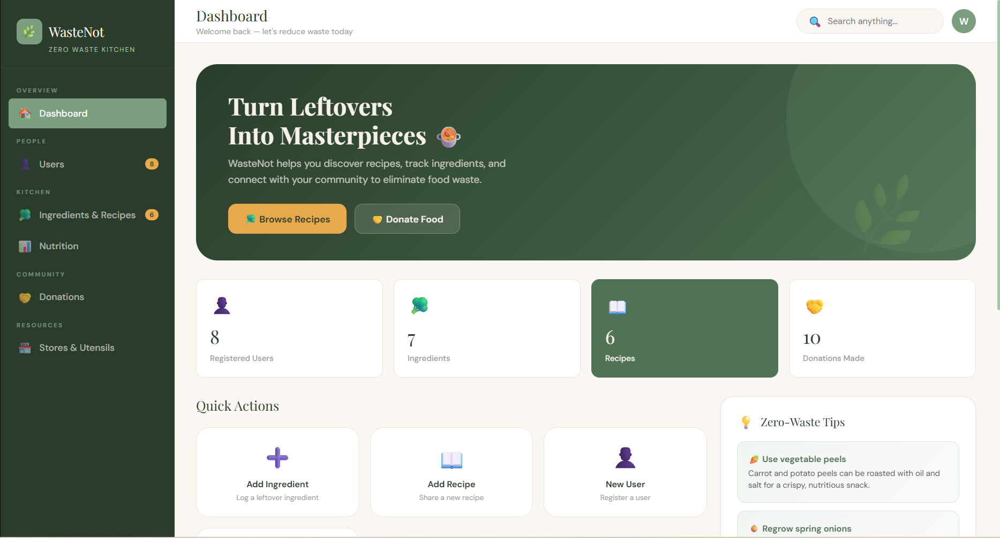

# WasteNot

This project manages leftover food ingredients by helping users repurpose them into new dishes or donate them to community services. The system supports nutrient lookup per weight, recipe search, nearby store/utensil discovery, and recording donations (who donated what, when, and where).

Users can also list their favorite recipes, as well as adding new recipes to the database.

